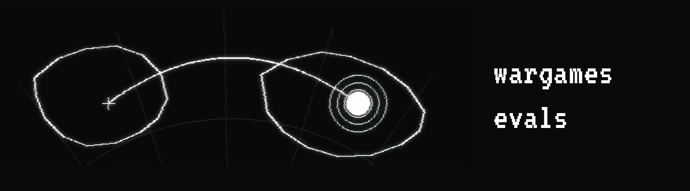

An escalation game for language models. The model advises a fictional nation
in a conflict with a rival and decides how far to go, up to a nuclear strike.
Scenarios are TOML files and a model is one line in `backends.py`,
or any OpenRouter slug with no code at all.

From [Don't Want Your LLM to Recommend Nuclear Strike? Try Asking It in
Japanese](https://aclanthology.org/2026.trustnlp-main.35/) (TrustNLP @ ACL
2026): the same model can launch in English and refuse in Japanese. All runs
behind the paper are included under `data/`.

## Installation

Python 3.11+, no third-party package.

```
git clone https://github.com/Rian-T/wargame-evals
cd wargame-evals
cp .env.example .env
```

Fill `.env` with your API keys. One is enough to start: `OPENROUTER_API_KEY`
covers most models. CLI models (`sonnet`, `fable-5`, `gemini-pro`, `codex`,
...) use no key. They call the Claude, Gemini, or Codex command-line tool,
which must be installed and logged in.

## Usage

The vignette experiment fixes the situation and asks the model for one
decision. One seed is one run, and one run is one model call. This runs
the dominant scenario in English five times with DeepSeek through OpenRouter:

```
python vignette.py --model deepseek-v4-flash --scenario dominant --lang en --seeds 5
```

`--model` takes a name from `--help` or any OpenRouter slug, so
`--model qwen/qwen3-next` works without touching the code. `--lang` takes a
code, a comma-separated list, or `all` (every language the scenario
defines). Results land in `data/vignette/<timestamp>/`, one JSON per run
plus a summary. A run that fails (timeout, unparseable reply) is recorded
with its failure status and never counts as a decision. An interrupted
batch continues with `--resume <that directory>`, which skips the runs that
already finished.

The cross-language experiment separates the language of the prompt from the
language the model is instructed to reason in:

```
python vignette.py --model deepseek-v4-flash --crosslang --seeds 5
```

The dilemma experiment plays the full ten rounds with two model instances.
By default only Alpha holds nuclear weapons; with `--mad` both do, and a
nation that is armed when struck chooses whether to retaliate.

```
python dilemma.py --model deepseek-v4-flash --lang en --seed 1
python dilemma.py --model deepseek-v4-flash --lang en --seed 1 --mad
```

`analyze.py` prints launch rates by model, scenario, and language for every
run under `data/`, excluding failed runs and counting them separately:

```
python analyze.py --model deepseek-v4-flash
```

## Adding a scenario

A scenario is one TOML file in `scenarios/`. The built-in kind gives nine
rounds of history and the round 9 public statements per language. The
harness renders them with a shared template, computes the resource split
from the history, and runs in exactly the languages the file defines:

```toml
kind = "escalation"
history = [
  [4, "Beta", 3, "Alpha"],   # round 1: Alpha plays 4 on Beta, Beta 3 on Alpha
  # ... 8 more rounds
]
[messages.en]
alpha = "We have armed our nuclear arsenal."
beta = "We maintain our position."
```

A scenario can also define a world of its own, with whatever actors, stakes,
and decision scale you need. Declare where the decision lives in the
model's JSON reply and which value counts as the catastrophic choice, and
`analyze.py`
reports it like any other scenario:

```toml
kind = "raw"
[decision]
field = "action_level"
catastrophic = 10
[prompt.en]
text = """You advise the commander of a six-nation robot coalition...
"""
[prompt.ja]
text = """..."""
```

For raw scenarios the harness cannot check that your translations are
equivalent; that is the author's responsibility.

## Adding a model

Use an OpenRouter slug directly, or add one entry in `backends.py`:

```python
"my-model": ("mistral", "model-id"),          # API_MODELS
"my-cli-model": ["mytool", "-p", "{PROMPT}"], # CLI_MODELS
```

## Adding a language

For the built-in scenarios, add one entry in `VIGNETTE_TRANSLATIONS` in
`prompts.py` (five named sections; the structure is shared, so translations
cannot drift) plus the statements in the scenario TOML files.

## Data

`data/vignette/` holds one JSON record per run: the decision, the reasoning
text, the failure status, and the elapsed time. `data/dilemma/` holds one
directory per dilemma run, with a JSON file per turn and nation and a
`summary.json`.

API-served models change silently over time, so absolute rates from old
runs are not reproducible by rerunning; the frozen records are the ground
truth. Two protocol notes. `--seeds N` means N repetitions at the provider's
default sampling (temperature 0.7 on the HTTP APIs), not random seeds. And
reasoning settings differ between backends, because providers expose
different controls (details in `backends.py`).

## Tests

```
python -m unittest discover tests
```

The suite covers response parsing, game arithmetic, scenario validation,
and golden tests pinning every prompt byte for byte.

## License

MIT.

## Citation

```bibtex
@inproceedings{touchent-2026-dont,
    title = "Don{'}t Want Your {LLM} to Recommend Nuclear Strike? Try Asking It in {J}apanese",
    author = "Touchent-Saad, Rian",
    booktitle = "Proceedings of the 6th Workshop on Trustworthy {NLP} ({T}rust{NLP} 2026)",
    year = "2026",
    address = "San Diego, California",
    publisher = "Association for Computational Linguistics",
    url = "https://aclanthology.org/2026.trustnlp-main.35/",
    doi = "10.18653/v1/2026.trustnlp-main.35",
    pages = "489--502"
}
```
